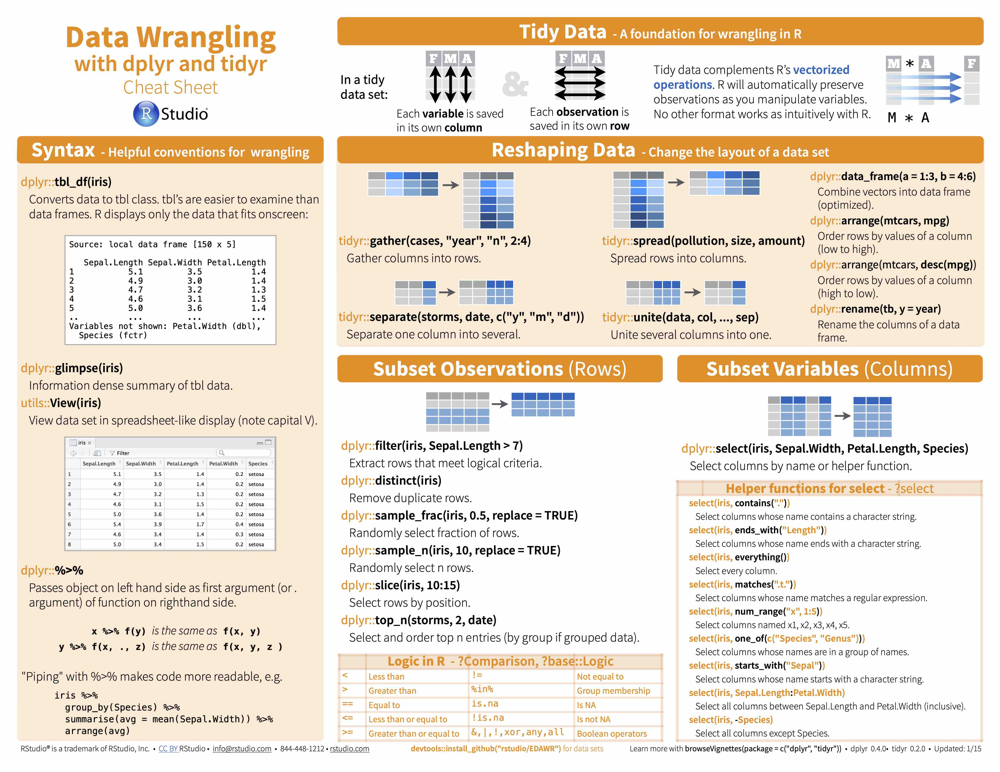

## Do First
Recreate the R code to make this plot:
```{r plot, echo=FALSE, message=FALSE}
library(ggplot2)
ggplot(data = diamonds, aes(x=carat, y=stat(count)))+
  geom_density(aes(fill=cut), position = "stack")+
  facet_wrap(~clarity, scales = "free")+
  theme_minimal()
  
```

***
<center>
[{width=40%}](https://rstudio.com/wp-content/uploads/2015/02/data-wrangling-cheatsheet.pdf)
</center>

<br>

***
