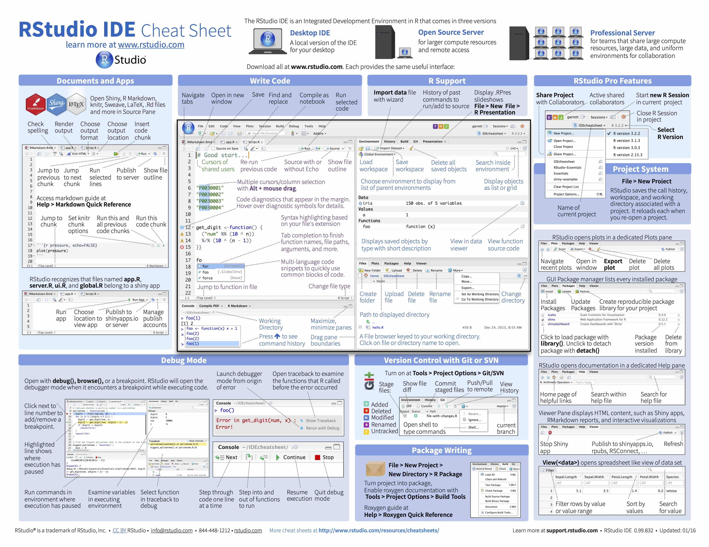

 

## Instructions for how to install R and RStudio

Before we can get started we need to install **two** different software programs, R and RStudio.   

Start by installing R:

* Go to [cran.r-project.org](https://cran.r-project.org)
    + Windows users click **Download R for Windows** and on the next page **install R for the first time** and finally **Download R 3.6.2 for Windows**.
    + Mac users click **Download R for (Mac) OS X** and on the next page pick the version matching the OS version you are using (for most users **R-3.6.2.pkg** will be the right choice).

Next we will install RStudio:

* Go to the [rstudio.com](https://rstudio.com/products/rstudio/download/) download page
* Scroll down until you see a blue rectangle with the text **DOWNLOAD RSTUDIO FOR X**, where x is the OS of the machine you are using. Click to download. 
* Alternatively, scroll down a bit more and find the right version of RStudio for your OS under the header **All Installers**.

 
It is possible to use a tablet for the things we are going to cover in the Coding Club (but this will not be a better experience than using a laptop). I have used an iPad successfully and although it is not possible to install R or RStudio on this type of tablet, there are ways of running RStudio online and accessing the software from a web browser. The best way to do so would be to create a free [RStudio Cloud](https://rstudio.cloud) account. Make sure your iPad is running iPadOS (iOS13 for iPad) and connect to RStudio Cloud using Safari. Using an external keyboard will be very helpful if not necessary.  

 

## Agenda 

Here are some topics we will cover the first Coding Club session:

* Troubleshooting installation (if necessary).
* We will talk about some reasons to choose R programming for data science.
* Dr. Walum will showcase some of his work to give an idea of what R + RStudio can be used for.
* We will write some very simple code (using the software as a calculator) to see how RStudio behaves.
* We will cover some tips for navigating the RStudio IDE (Integrated Development Environment). See image below and click to access the online pdf version of a RStudio IDE cheat sheet: 

 

[{width=40%}](https://rstudio.com/wp-content/uploads/2016/01/rstudio-IDE-cheatsheet.pdf)

 

***